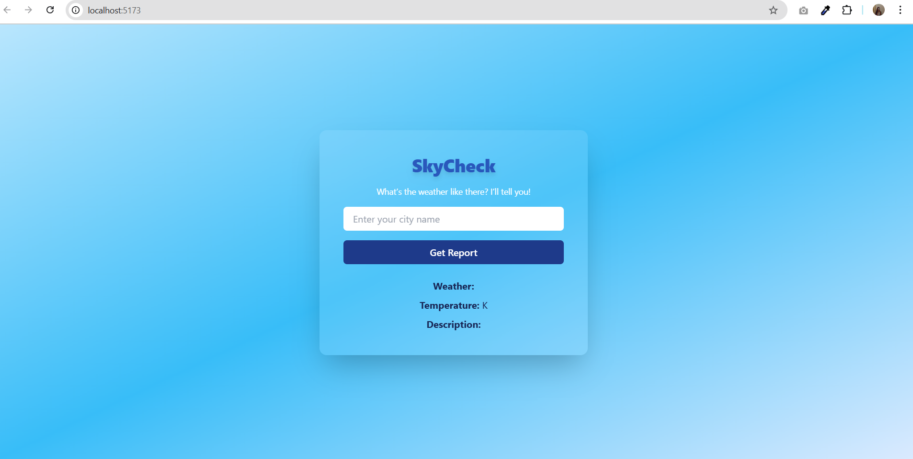

# 🌤️ SkyCheck - Weather App

**SkyCheck** is a beautiful, responsive weather forecast web app built with **React**, **Axios**, and **Tailwind CSS**. It lets users check real-time weather conditions for any city worldwide.

---

##  Screenshots

### 🔹 Desktop View


### 🔹 Mobile View


> 📸 Replace the image URLs above with your actual screenshots.

---

##  Features

-  Enter any city name to get the current weather
-  Displays temperature (Kelvin)
-  Shows main weather condition and description
-  Clean and modern UI with smooth transitions
-  Fully responsive for both desktop and mobile

---

##  Tech Stack

- **React JS** – Frontend Framework
- **Axios** – For API integration
- **Tailwind CSS** – Styling & animations
- **OpenWeatherMap API** – Weather data provider

---

##  API Used

Data is fetched from **[OpenWeatherMap](https://openweathermap.org/api)**.

Replace this line in the code to use your API key:

```js
`https://api.openweathermap.org/data/2.5/weather?q=${city}&appid=YOUR_API_KEY`

## Folder structure 

weatherApp/
├── src/
│   ├── Weather.jsx
│   ├── App.jsx
│   ├── main.jsx
│   └── index.css
├── public/
│   └── index.html
├── tailwind.config.js
├── postcss.config.js
├── package.json
└── README.md
